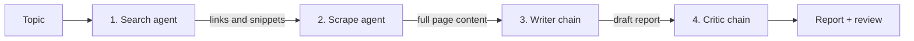

<div align="center">

# Research Desk

**A multi-agent research assistant. Give it a topic, get a reviewed report.**

Four AI agents search the web, read the best source in full, write a report and have a critic check it.


</div>

---

## Overview

Research Desk turns a single topic into a written, reviewed report. Instead of one model doing everything, the work is split across four specialised steps, each with one job. You can run it from a clean Streamlit web app or straight from the terminal.

## How it works



| Step | Component | What it does |
|---|---|---|
| 1. Search | `web_search_agent` | Finds recent, reliable information about the topic |
| 2. Read | `scrape_url_agent` | Picks the most relevant URL and scrapes it for depth |
| 3. Write | `writer_chain` | Combines search results and page content into a report |
| 4. Review | `critics_chain` | Reviews the report and gives feedback |

## Features

- **Four-step agent pipeline** with a separate agent or chain for each job
- **Streamlit web app** with a live progress list, a readable report view and a download button
- **Result tabs**: final report, the critic's review, raw search results and scraped page content
- **Token-limit handling**: if the model returns a 413 or 429 error, the app shortens its input, waits if needed and retries automatically
- **Graceful fallback**: if a page is too large to read, the report is written from the search results and you are told
- **Terminal mode** through `pipeline.py` if you prefer the command line

## Quick start

**1. Clone and enter the project**

```bash
git clone https://github.com/Precipitation-Rain/<your-repo-name>.git
cd <your-repo-name>
```

**2. Create a virtual environment and install dependencies**

```bash
python -m venv .venv

# Windows
.venv\Scripts\activate
# macOS / Linux
source .venv/bin/activate

pip install -r requirements.txt
pip install "streamlit>=1.39"
```

**3. Add your API keys**

Create a `.env` file in the project root with the keys your agents and tools need, for example:

```env
GROQ_API_KEY=your_key_here
```

> Keep `.env` out of version control. It is already listed in `.gitignore`.

**4. Run it**

```bash
streamlit run app.py
```

Then open the local URL Streamlit prints (usually `http://localhost:8501`), type a topic and press **Research**.

## Using the terminal instead

```bash
python pipeline.py
```

Enter a topic when prompted. Each step prints its output as it finishes.

## Project structure

```
.
├── app.py              # Streamlit web interface
├── pipeline.py         # Command-line version of the four-step pipeline
├── agents.py           # Search agent, scrape agent, writer chain, critic chain
├── tools.py            # Tools the agents call (web search, scraping)
├── requirements.txt    # Python dependencies
├── .env                # API keys (not committed)
└── .gitignore
```

## A note on rate limits

Some free model tiers cap each request at a fixed number of tokens per minute. Long search results plus a scraped page can go over that cap and return an error like `413 Request too large`.

`app.py` handles this for you:

1. It sends only part of the earlier step's output to the next step.
2. On a token-limit error it shrinks that input and retries, waiting first if the API says how long.
3. If the read step still cannot fit, it continues with the search results alone and shows a notice.

If you hit limits often, capping the length of what `tools.py` returns from a scraped page is the most effective fix.

## Tech stack

- **Python** for the pipeline
- **Streamlit** for the interface
- **Groq**-hosted language models for the agents
- **python-dotenv** for loading API keys

## Customising

- **App name and example topics:** edit `APP_NAME` and `EXAMPLES` near the top of `app.py`.
- **Agent behaviour and prompts:** edit `agents.py`.
- **Look and feel:** the styles live in the `CSS` block in `app.py`.

---

## Contact

Built by **Rajvardhan Shewale**. Questions, feedback and ideas are welcome.

<div align="center">

[](mailto:your.email@example.com)
[](https://www.linkedin.com/in/your-username)
[](https://github.com/Precipitation-Rain)

</div>